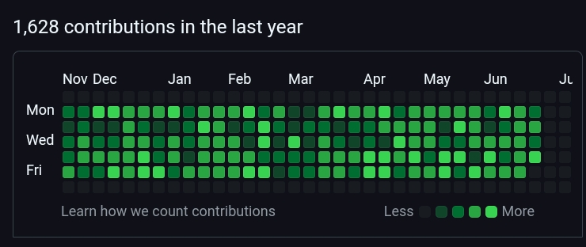

<p align="center">
  
</p>
<h1 align="center">Contributor</h1>

This repository allows you to automatically populate your GitHub contribution chart with incremental contributions. Each time the workflow runs, it updates a contribution counter and commits the change, effectively filling up your contribution graph on GitHub.
By forking this repository and setting up the workflow, you'll be able to increase your contribution without manually committing code.

Result:
<p align="center">
  
</p>


## Forking the Repository

Follow these steps to fork the repository and set it up for your own use:

### 1. **Fork the Repository**

- Navigate to the repository you want to fork (this one).
- Click on the **Fork** button located at the top-right corner of the repository page.
- Choose your GitHub account or an organization where you want to fork the repository.

### 2. **Clone Your Fork**

After forking the repository, you can clone it to your local machine to work with it.

1. Go to your GitHub account and open the forked repository.
2. Click on the **Code** button and copy the repository URL (HTTPS or SSH).
3. Open a terminal on your local machine and run the following command:

   ```bash
   git clone https://github.com/NanduWasTaken/contributor.git
   ```


### 3. **Navigate to the Project Directory**

After cloning the repository, move into the project directory:

```bash
cd contributor
```

### 4. **Set Up GitHub Actions**

The repository uses GitHub Actions to automate the increment of the contribution count. Follow these steps to ensure the workflow runs on your fork:

1. Go to the **Actions** tab of your forked repository on GitHub.
2. Ensure the workflow file (`contrib.yml`) is correctly set up under `.github/workflows/`.
3. If you want the workflow to run on a schedule or on manual triggers, you can either wait for the scheduled run or trigger it manually from the **Actions** tab.

### 5. **Configure Secrets**

This is essential to commit code as you.

1. Go to your forked repository on GitHub.
2. Click on **Settings** > **Secrets** > **New repository secret**.
3. Add the following secrets:
   - `GH_EMAIL` – Your GitHub email address (e.g., `yourname@example.com`).
   - `GH_USERNAME` – Your GitHub username (e.g., `yourname`).

### 6. **Allow the Action to Make Changes**

To Allow the Action to commit changes as you, You can allow this settings at **Settings** > **Actions** > **General** > **Workflow permission**.:


### 7. **Run the Workflow**

Once everything is set up, you can trigger the workflow in two ways:

1. **Manually**:
   - Go to the **Actions** tab.
   - Select the "Contribute" workflow.
   - Click **Run workflow**.

2. **Scheduled**:
   - The workflow is set to run every hour automatically, thanks to the cron schedule (`0 * * * *`).

The workflow will increment the value in `contrib.txt` each time it runs, and the commit message will reflect the incremented contribution count.

---

## Contributing to the Repository

If you want to contribute or suggest changes to the repository:

1. **Fork** the repository (as explained above).
2. **Clone** your fork to your local machine.
3. Make any changes or improvements you'd like.
4. **Push** the changes back to your forked repository.
5. **Open a Pull Request** from your fork to the original repository.

---

## License

This project is licensed under the MIT License – see the [LICENSE](LICENSE) file for details.

---

Let me know if you need any adjustments to the `README.md` or if you'd like to include additional sections!
